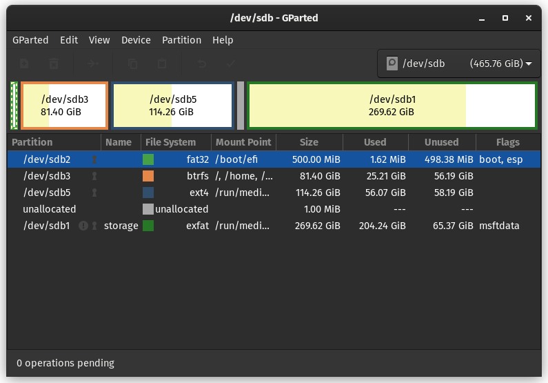
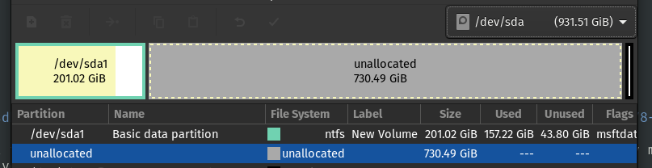

# So you really want to clone your OS....
Well, assuming you've navigated through the parent tutorial, we'll skip the basics. If you're cloning your OS I assume you're aware of boot, home and root partitions. I'll show my own drive that has my OS and what partitions are for what. Here's the drive structure:
```console
sdb           8:16   0 465.8G  0 disk 
|-sdb1        8:17   0 269.6G  0 part /run/media/kratoes669/7FFD-CD8E
|-sdb2        8:18   0   500M  0 part /boot/efi
|-sdb3        8:19   0  81.4G  0 part /var/log
|                                     /var/tmp
|                                     /var/cache
|                                     /srv
|                                     /root
|                                     /home
|                                     /var/lib/snapd/snap
|                                     /
`-sdb5        8:21   0 114.3G  0 part /run/media/kratoes669/26fdea9e-917a-47c6-8978-0ae341b1459c
```
All the partitions with a `/run` prefix are mounted as separate drives though they might not be physically in different external drives.

## Identify the *boot* partition:
It is actually visible which partition is the boot partition, in case it is not, just launch `gparted` and see the name of the partition that is in FAT32 formatting and wouldn't be greater that 500M. In my case it is `/dev/sdb2/`

## Identify where everything is installed:
These will be the ones with the `/root` and `/home` flags. In my case, root and home flags are on same partition so I need to copy only this partition. In case these would've been on different partitions I would've had to copy them both.
## Let's get it done without
Now in gparted, navigate to your target disk and make an unallocated space >= to the total of the boot, home and root partitions.
It'll look something like this:

Now right click on the greyed out space and then click on `New partition`. Make a partition of 500M of FAT32 type and note its name. We've created a `boot` partition on the target disk where the original boot partition will be cloned. Do the same for the `home` and the `root` partitions. Now that you have the names of these partitions and the source drive, we're almost done.

<p float="center">
  
  
</p>


### Terminal time
Open the terminal and type in the commands:
```console
sudo dd if=/dev/path/to/sourceboot of=/dev/path/to/targetboot conv=noerror,sync status=progress bs=100k
sudo dd if=/dev/path/to/sourcehome of=/dev/path/to/targethome conv=noerror,sync status=progress bs=100k
sudo dd if=/dev/path/to/sourceroot of=/dev/path/to/targetroot conv=noerror,sync status=progress bs=100k
```
For the images and assumptions taken in this tutorial the above commands will look something like:
```console
sudo dd if=/dev/sdb2 of=/dev/sda2 conv=noerror,sync status=progress bs=100k
sudo dd if=/dev/sdb4 of=/dev/sda4 conv=noerror,sync status=progress bs=100k
sudo dd if=/dev/sdb3 of=/dev/sda3 conv=noerror,sync status=progress bs=100k
```
*And We're Done!!*
Now just boot from your target drive and everything should be exactly as you remember from your source drive. Yeah it's tiring but atleast I don't have to pay someone for such a simple thing🥱
